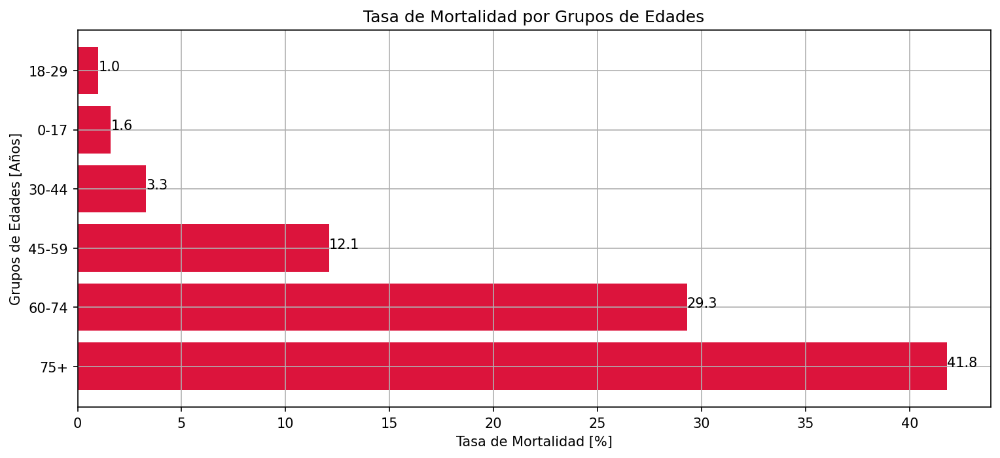
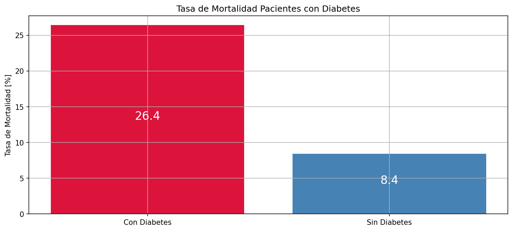
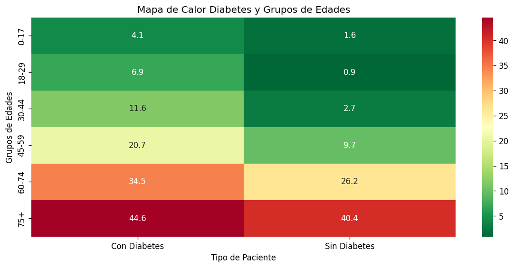
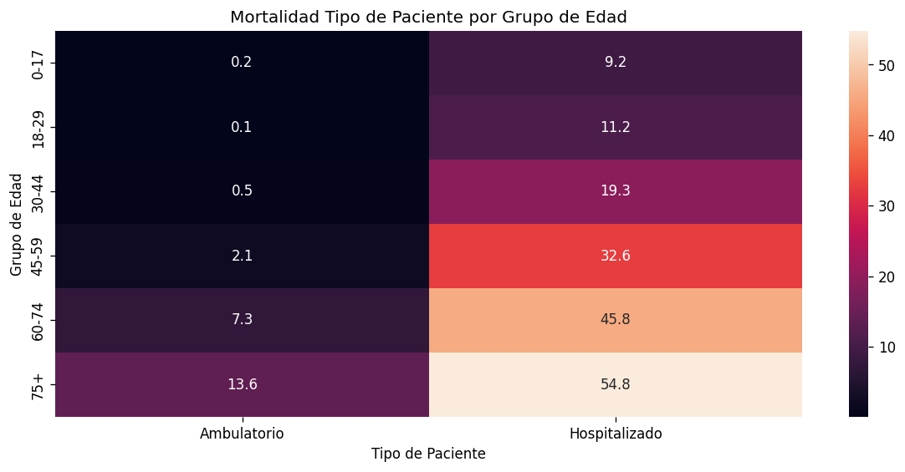

# Análisis de Mortalidad por COVID-19 en México

## Descripción
Conocer la población más vulnerable cuando se trata de COVID-19 es un aspecto 
fundamental para las instituciones de salud, pues se podría adaptar el TRIAGE 
a la incidencia más afectada o con mayor tasa de mortalidad. Con base en 370,712 
casos confirmados del registro oficial de la Secretaría de Salud, este análisis 
explora el impacto de factores como edad, diabetes y tipo de atención sobre la 
tasa de mortalidad.

## Hallazgos Principales
- 📈 La tasa de mortalidad aumenta 26 veces entre menores de 17 y mayores de 75 años
- 🩺 Pacientes con diabetes tienen 3x más mortalidad que pacientes sin diabetes (26.4% vs 8.4%)
- ⚠️ En el grupo 18-29, padecer diabetes eleva la mortalidad 7.6 veces
- 🏥 Pacientes hospitalizados del grupo 18-29 tienen 112 veces más mortalidad que ambulatorios

## Visualizaciones

### Mortalidad por Grupo de Edad


### Mortalidad por Diabetes


### Heatmap: Diabetes y Grupo de Edad


### Heatmap: Tipo de Paciente y Grupo de Edad


## Herramientas


## Estructura del Repositorio
```
covid-mortalidad-mexico/
├── analisis-de-mortalidad-por-covid-19-en-mexico.ipynb     ← análisis completo
├── images/      ← visualizaciones
    └── Mortalidad_por_edad.png    
    ├── Mortalidad_por_diabetes.png
    ├── Heatmap_diabetes_edad.png
    ├── Heatmap_tipo_paciente.png       
└── README.md
```
## Notebook en Kaggle
[](https://www.kaggle.com/code/carlosroberto0712/an-lisis-de-mortalidad-por-covid-19-en-m-xico)

## Autor
**Carlos Roberto Díaz** — [LinkedIn](https://www.linkedin.com/in/carlosrobertod)
